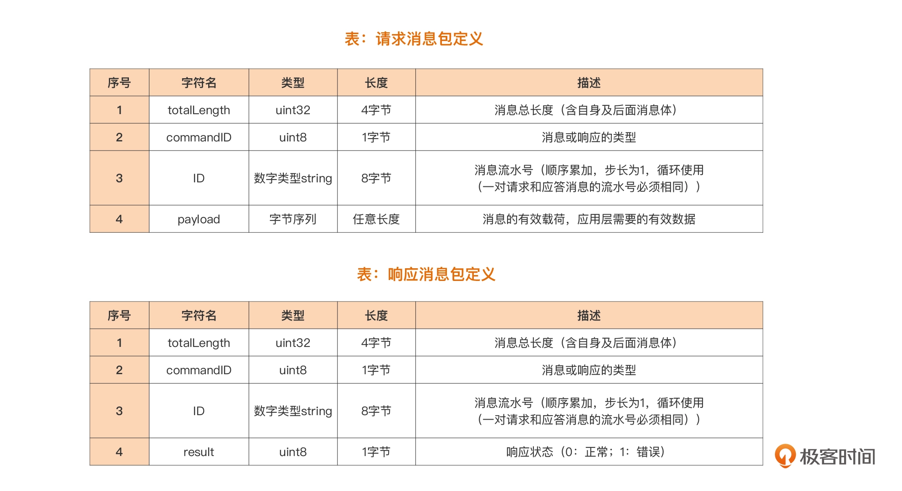
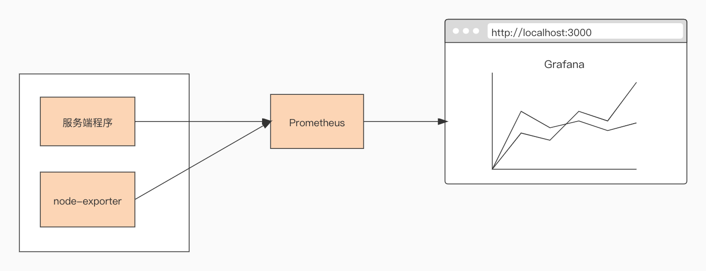

# Go实现一个TCP服务器  

本仓库配套极客时间《Go语言第一课》实战篇  

## 需求  

实现一个基于 TCP 的自定义应用层协议的通信服务端。  

## 实现  

自定义协议规范  
  

## 启动 monitor  

```
$ docker-compose -f docker-compose.yml up -d

$ docker ps                                   
CONTAINER ID   IMAGE                                     COMMAND                  CREATED          STATUS          PORTS     NAMES
f2573442e1bc   grafana/grafana:latest                    "/run.sh"                18 seconds ago   Up 17 seconds             grafana
5ebb57f39320   prom/prometheus:latest                    "/bin/prometheus --c…"   18 seconds ago   Up 17 seconds             prometheus
fcc6a9310736   quay.io/prometheus/node-exporter:latest   "/bin/node_exporter …"   18 seconds ago   Up 17 seconds             node_exporter
```

整个观测设施中各个工具之间的关系:  
  


pprof剖析  
```
$ go tool pprof -http=:9090 http://127.0.0.1:6060/debug/pprof/profile
```